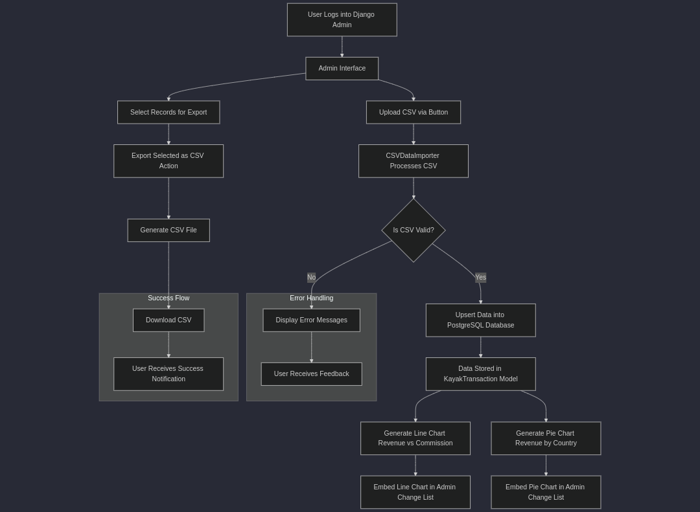

# Features

The `cron_project` offers a wide range of features designed to simplify data management and provide insightful visualizations. Below is a detailed overview of the key functionalities:

## 1. CSV Import and Export

- **Import CSV:** Administrators can upload transaction data using a simple CSV import interface. The system validates the uploaded data for errors, ensuring only accurate records are added.
- **Export CSV:** Selected transactions can be exported to CSV format, making it easy to share or analyze data externally.

## 2. Interactive Data Visualizations

- **Line Chart – Monthly Revenue vs. Commission:**  
  Displays monthly trends in revenue and commission to help administrators identify growth patterns and seasonal changes.
- **Pie Chart – Revenue by Country:**  
  Illustrates the geographic distribution of revenue, highlighting key markets and enabling strategic planning.

### Workflow Diagram

The following diagram provides a visual overview of the project's key functionalities and workflow:

This diagram illustrates how various components—such as data import, validation, visualization, and export—integrate into the overall system.

## 3. Custom Admin Dashboard

- **Integrated Features:** All functionalities, including data import/export and visualizations, are embedded within the Django Admin interface for ease of use.
- **User-Friendly Design:** The admin interface maintains Django’s familiar look and feel while enhancing usability with additional tools.

## 4. Data Integrity and Maintenance

- **Unique Transaction IDs:** Ensures that all transactions are uniquely identified, preventing duplication and maintaining clean records.
- **Upsert Operations:** Automatically handles both the creation of new records and updates to existing records, ensuring data consistency.

## 5. Error Handling and Notifications

- **Validation Feedback:** Provides detailed error messages for invalid CSV uploads, allowing administrators to address issues promptly.
- **Notifications:** Uses Django’s messaging framework to inform users of the success or failure of data operations, ensuring transparency.

---